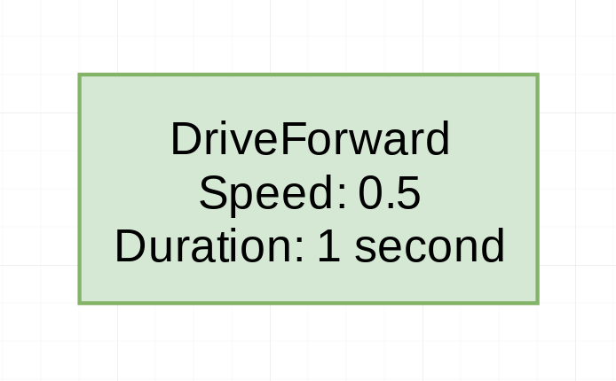
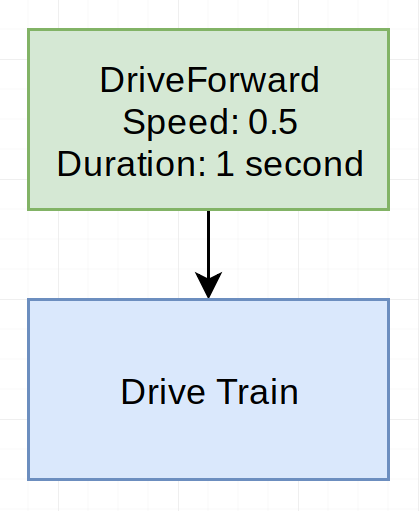
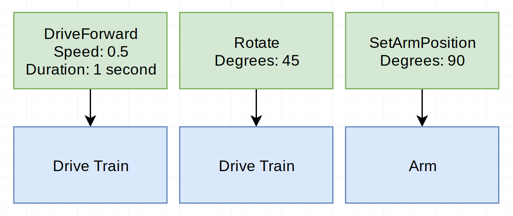
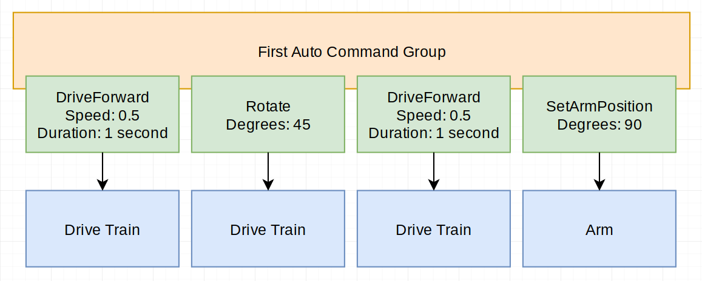
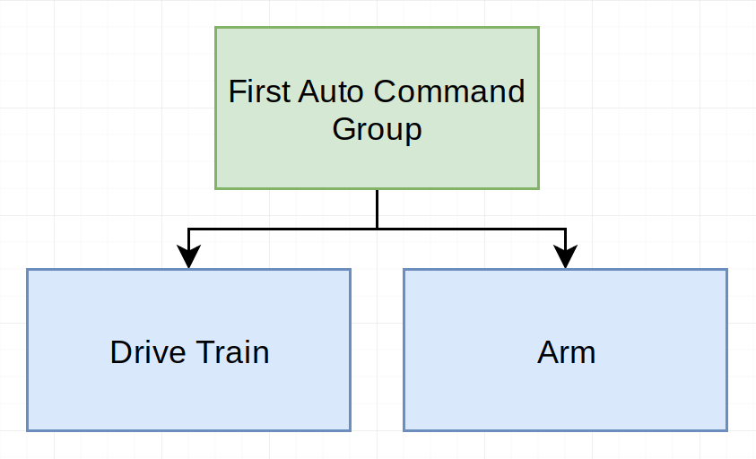

Commands I
==========

This tutorial is a bit more of an extended guide on the general command
framework included in WPILib.

As always, if at any point you have questions or need help, ask in `#sw_general`
on Slack!

## General Overview
The WPILib command framework (WCF) is composed of a few very simple
components: `Subsystem`, `Command`, `CommandGroup`, and `Scheduler`.

### Subsystem
The `Subsystem` class represents our mechanisms to the WCF.
"Mechanisms" are concepts like the drive train, arm, pistons,
turrets, and lights. Basically, if it can be controlled, it is
part of a `Subsystem`.

For example: In the code, our `DriveTrain` class would extend `Subsystem`.

### `Scheduler`
The `Scheduler` class is responsible for tracking the commands that
are currently running and the systems that are in use. You rarely
need to call anything but `Scheduler.run()`, since everything else
happens in other classes, or references `Scheduler` internally.

### `Command`
The `Command` class is the base for running our own code in the WCF.
It is the only way to execute any code under the `Scheduler`, and
offers a variety of different choices on when to run your code.
It also offers timekeeping mechanisms, which are useful for tracking
timeouts.

`Command` can also keep track of what `Subsystem`s are used by the
command, to prevent dangerous conflicts between commands.

### `CommandGroup`
The `CommandGroup` class is a specialized `Command` that allows you
to run multiple commands in a sequence. This is useful for designing
autonomous routines, since each part of the auto can be a single
`Command`.

## Example
The command system can be a bit much to understand. The best way to
learn how it works is by example.

(Note: These examples will use green for any `Command`, orange for
any `CommandGroup`, and blue for the dependencies / subsystems.)
 
We'll start with a simple driving
command, `DriveForward`. This command simply sets the power to
whatever we want, for as much time as we specify:

This `DriveForward` isn't quite complete though. In order to
move, the command will call `setPower` on our `DriveTrain`
class. However, if we were to run another command that _also_
used `DriveTrain`, it would be crazy! The wheels would flip
between two different powers multiple times per second, and
if it were a different mechanism it could cause severe damage.

To prevent this from happening, the `Command` class has the
`requires(Subsystem)` method. If we pass the `DriveTrain` to
this method, we will prevent any other command from running
at the same time. We will represent that like this:

Now we have a complete command! The next thing we want to do is build
an autonomous routine with a few commands. Imagine we add a few more
commands, `Rotate` -- rotates the robot clockwise the given number of
degrees, and `SetArmPosition` -- sets the position of the arm to a
certain location. We want the robot go forwards a little bit,
rotate, move forwards some more, and then put the arm straight up,
at 90 degrees. Here's the `Command` visual:

Note how the `Rotate` command relies on the `DriveTrain` still --
it uses the wheels to rotate the robot. But the `SetArmPosition`
command just relies on the `Arm`, because it doesn't touch the wheels.

We have just one problem -- we can't add all of these commands to the
`Scheduler` and just let it go, because they would all run at the
same time (except for `DriveForward` and `Rotate`, because they both
use the `DriveTrain`!). We need some way to say "wait until this
command finishes before starting the next one". Enter `CommandGroup`.
This class allows us to define a sequence of commands to run that
will wait for the previous ones to finish. Here is the visual:

Notice that one of the commands was duplicated, because we wanted
to drive forward **twice** for this auto.

If you read the *General Overview* section above, then you know that
a `CommandGroup` is also a `Command`. That means that it also can
`require` subsystems like the `DriveTrain` and `Arm`. How does a
`CommandGroup` decide what it's requirements are? By looking at the
`Command`s inside of it. If we represented the entire auto as one
`Command`, it would look like this:

Notice that it requires both the `DriveTrain` and the `Arm`. This is
because the commands it contains require both of those as well. This
auto routine would not allow any other command that uses the `DriveTrain`
or `Arm` to run, except for the "child" commands that it contains.

(For example, if we used a command to take input from the joysticks
and drive the robot, it could not run at the same time as this auto.)

This concludes the general introduction to the WCF. In the next part,
I'll go over how these diagrams convert to code.
