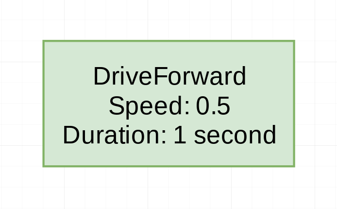

Commands
===================

This tutorial is a bit more of an extended guide on the general command
framework included in WPILib.

As always, if at any point you have questions or need help, ask in `#sw_general`
on Slack!

## General Overview
The WPILib command framework (WCF) is composed of a few very simple
components: `Command`, `CommandGroup`, and `Scheduler`.

### `Scheduler`
The `Scheduler` class is responsible for tracking the commands that
are currently running and the systems that are in use. You rarely
need to call anything but `Scheduler.run()`, since everything else
happens in other classes, or references `Scheduler` internally.

### `Command`
The `Command` class is the base for running our own code in the WCF.
It is the only way to execute any code under the `Scheduler`, and
offers a variety of different choices on when to run your code.
It also offers timekeeping mechanisms, which are useful for tracking
timeouts.

### `CommandGroup`
The `CommandGroup` class is a specialized `Command` that allows you
to run multiple commands in a sequence. This is useful for designing
autonomous routines, since each part of the auto can be a single
`Command`.

## Example
The command system can be a bit much to understand. The best way to
learn how it works is by example.

(Note: These examples will use green for any `Command`, orange for
any `CommandGroup`, and blue for the dependencies / subsystems.)
 
We'll start with a simple driving
command, `DriveForward`. This command simply sets the power to
whatever we want, for as much time as we specify:

This `DriveForward` isn't quite complete though. In order to
move, the command will call `setPower` on our `DriveTrain`
class. However, if we were to run another command that _also_
used `DriveTrain`, it would be crazy! The wheels would flip
between two different powers multiple times per second, and
if it were a different mechanism it could cause severe damage.

To prevent this from happening, the `Command` class has the
`requires(Subsystem)` method. If we pass the `DriveTrain` to
this method, we will prevent any other command from running
at the same time. We will represent that like this:

